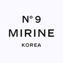

# Mirine React Project

#### Mirine를 소개합니다

**React와 OpenMacketAPI를 이용해서 만들어본 향수와 아로마슈터를 판매하는 웹사이트 프로젝트입니다.**

---

#### 📚 목차

- [🗂️ 프로젝트 개요](#프로젝트-개요)
- [⏱️ 프로젝트 기간](#프로젝트-기간)
- [🚀 배포 링크](#배포-링크)
- [🛠️ 기술 스택 / 협업 툴](#기술-스택--협업을-위한-툴)
- [👨‍👩‍👧‍👦 팀 소개](#팀-소개)
- [✨ 주요 기능](#주요-기능)
- [📁 프로젝트 구조](#프로젝트-구조)
- [▶️ 실행 방법](#실행-방법)
- [📝 회고](#회고)

---

#### 🗂️ 프로젝트 개요

> React와 OpenMacketAPI를 이용해서 만들어본 향수와 아로마슈터를 판매하는 웹사이트 프로젝트입니다.

---

#### ⏱️ 프로젝트 기간

📆 2025.07.07 ~ 2025.08.08 (총 33일간)

---

#### 🚀 배포 링크

[Mirine 프로젝트 보러가기](https://final-09-mirine.vercel.app/)

---

#### 🛠️ 기술 스택 / 협업을 위한 툴

| 분류         | 사용 툴                                                                                                                                                                                                                                                                                                                                                                                                                                                                                                                         |
| ------------ | ------------------------------------------------------------------------------------------------------------------------------------------------------------------------------------------------------------------------------------------------------------------------------------------------------------------------------------------------------------------------------------------------------------------------------------------------------------------------------------------------------------------------------- |
| 🎨 디자인 툴 |                                                                                                                                                                                                                                                                                                                                                                                                                               |
| 💻 언어      |      |
| 📦 패키지    |                                                                                               |
| ⚙️ 툴 체인   |                                                                                                                                                                                                                                                                                                                                                                                                                                  |
|              |
| 💻 개발 환경 |                                                                                                                                                                                                                                                                                                                                                                                               |
| 🤝 협업 툴   |                                                                                                                   |
| 🌍 배포      |                                                                                                                                                                                                                                                                                                                                                                                                                         |

---

#### 🧑‍💻 설치 방법

원활한 개발 환경을 위해 터미널에 아래 명령어를 입력해주세요:

```
git clone https://github.com/FRONTENDBOOTCAMP-13th/Final-09-MIRINE.git
npm i
```

<br>

📦 설치될 주요 패키지 목록

- typescript
- next
- vite
- eslint
- eslint-config-prettier
- @eslint/js
- gitignore

---

#### 👨‍👩‍👧‍👦 팀 소개

> "향을 모르고 사는 시대는 끝났다"<br>우리는 향수를 파는 게 아니라,<br>향기로 완성되는 일상의 행복을 판다.<br>

**안녕하세요 향수와 아로마슈터를 판매하는 팀 미리내입니다!**

| 팀장 | 팀원 | 팀원 | 팀원 |
| ---- | ---- | ---- | ---- |

|

<!-- (승균님)이미지 -->

|

<!-- (상희님)이미지 -->

|  
  
|

<!-- (예린님)이미지 -->

|
| 최승균  
| 박상희  
| 신동수  
| 홍예린  
|
|

|

|

|

|
|  
[최승균 깃허브 링크](https://github.com/seuchoi0531)  
|  
[박상희 깃허브 링크](https://github.com/2sign)  
|  
[신동수 깃허브 링크](https://github.com/Dongsusin?tab=repositories)  
|  
[홍예린 깃허브 링크](https://github.com/hhongye)  
|
|

---

##### ✨ 주요 컴포넌트 및 페이지

✅ 헤더  
✅ 푸터  
✅ 홈(메인)페이지  
✅ 미리내 페이지  
✅ 향수 페이지  
✅ 아로마 슈터 페이지
✅ 향수 테스트 페이지
✅ 리뷰 페이지
✅ 로그인 페이지
✅ 회원가입 페이지
✅ 마이 페이지
✅ 장바구니

---

#### 📁 프로젝트 구조

Mirine 프로젝트 구조의 예시를 표시한것입니다.

```
📂 Mirine
 ┣ 📂 public
 ┃  ┣ 📂aromaShooter
 ┃  ┣ 📂font
 ┃  ┣ 📂footer
 ┃  ┣ 📂header
 ┃  ┣ 📂home
 ┃  ┣ 📂icon
 ┃  ┣ 📂image
 ┃  ┣ 📂logo
 ┃
 ┣ 📂  src
 ┃  ┃  ┣ 📂 api
 ┃  ┃  ┣ 📂 app
 ┃  ┃  ┣ 📂 assets
 ┃  ┃  ┣ 📂 components
 ┃  ┃  ┣ 📂 hooks
 ┃  ┃  ┣ 📂 lib
 ┃  ┃  ┣ 📂 store
 ┃  ┃  ┣ 📂 types
 ┃
 ┣ 📄 package.json
 ┣ 📄 package-lock.json
 ┣ 📄 README.md
 ┣ 📄 .gitignore
 ┣ 📄 .tsconfig.json
 ┣ 📄 .eslint.config.js
```

---

### 📝 회고

<details>
  <summary><span style="font-size: 1.5em; font-weight: bold;">🧑‍⚖️최승균</span></summary>
  <blockquote>
  <!-- (승균님)회고내용 -->
  </blockquote>
</details>

<details>
  <summary><span style="font-size: 1.5em; font-weight: bold;">👨‍🔧박상희</span></summary>
  <blockquote>
 <!-- (상희님)회고내용 -->
  </blockquote>
</details>

<details>
  <summary><span style="font-size: 1.5em; font-weight: bold;">👨‍🔧 신동수</span></summary>
  <blockquote>
    이번 프로젝트를 통해 지금까지 배운 내용을 정리하고 실제로 활용해볼 수 있어 매우 유익한 시간이었습니다.<br>
    React와 Next.js를 활용하여 웹사이트를 구현하면서, 단순하고 간단해 보이는 기능들도<br>
    실제로 구현해보면 생각보다 복잡하고 어려운 부분이 많다는 것을 깨달았습니다.<br>
    특히 다양한 API와의 연동 과정을 직접 경험하면서 많은 것을 배울 수 있었고,<br>
    복잡한 기능을 하나씩 구현해 나가는 과정 자체가 매우 의미 있는 경험이었습니다.
  </blockquote>
</details>

<details>
  <summary><span style="font-size: 1.5em; font-weight: bold;">👨‍🔧홍예린</span></summary>
  <blockquote>
  <!-- (예린님)회고내용 -->
  </blockquote>
</details>

---
